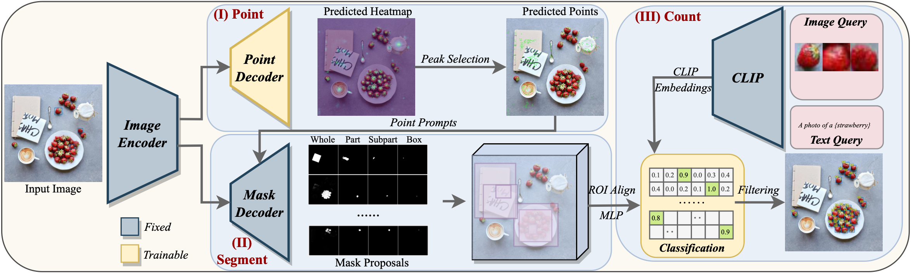
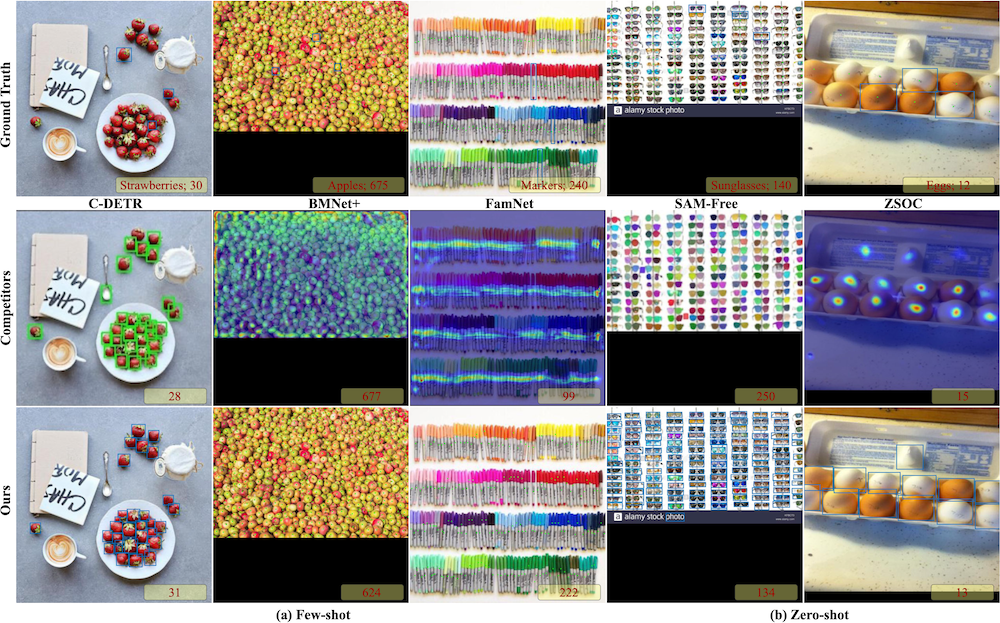
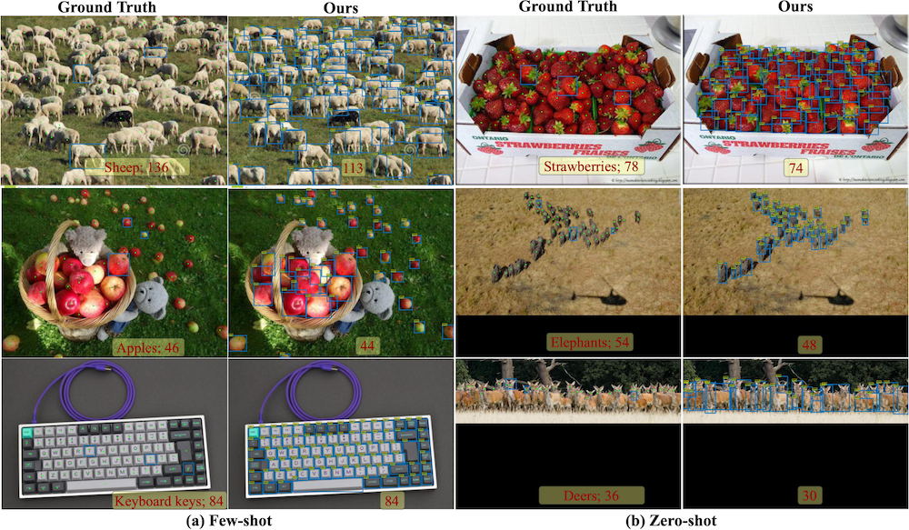
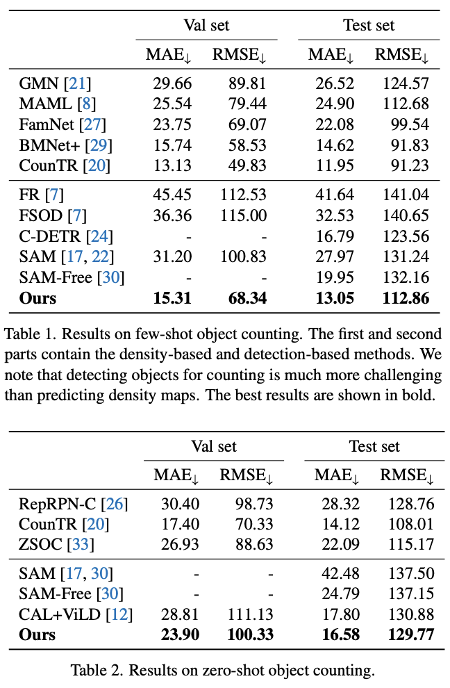

## Class-agnostic object counting with PseCo

This repo provides the official implementation of our [PseCo](https://arxiv.org/abs/2311.12386) for class-agnostic object counting, which combines the advantages of two foundation models of computer vision: CLIP and Segment Anything Model.

> Point, Segment and Count: A Generalized Framework for Object Counting <br>
> https://arxiv.org/abs/2311.12386 <br>
> Abstract: Class-agnostic object counting aims to count all objects in an image with respect to example boxes or class names, \emph{a.k.a} few-shot and zero-shot counting. Current state-of-the-art methods highly rely on density maps to predict object counts, which lacks model interpretability. In this paper, we propose a generalized framework for both few-shot and zero-shot object counting based on detection. Our framework combines the superior advantages of two foundation models without compromising their zero-shot capability: (\textbf{i}) SAM to segment all possible objects as mask proposals, and (\textbf{ii}) CLIP to classify proposals to obtain accurate object counts. However, this strategy meets the obstacles of efficiency overhead and the small crowded objects that cannot be localized and distinguished. To address these issues, our framework, termed PseCo, follows three steps: point, segment, and count. Specifically, we first propose a class-agnostic object localization to provide accurate but least point prompts for SAM, which consequently not only reduces computation costs but also avoids missing small objects. Furthermore, we propose a generalized object classification that leverages CLIP image/text embeddings as the classifier, following a hierarchical knowledge distillation to obtain discriminative classifications among hierarchical mask proposals. Extensive experimental results on FSC-147 dataset demonstrate that PseCo achieves state-of-the-art performance in both few-shot/zero-shot object counting/detection, with additional results on large-scale COCO and LVIS datasets.

**If you found this code helps your work, do not hesitate to cite my paper or star this repo!**

### Framework


### Qualitative Comparisons


### Qualitative Comparisons


### Results on object counting: FSC-147


### Install requirements

Install the environments
```shell
python -m venv venv
venv/bin/activate
```

Install detectron2: https://detectron2.readthedocs.io/en/latest/tutorials/install.html
```shell
python -m pip install detectron2==0.6 -f \
https://dl.fbaipublicfiles.com/detectron2/wheels/cu113/torch1.10/index.html
```
Install torch (2.0.0) and torchvision: https://pytorch.org/get-started/previous-versions/
```shell
pip install torch==2.0.0 torchvision==0.15.1 torchaudio==2.0.1 --index-url https://download.pytorch.org/whl/cu118
```
and then install other requirements:
```shell
pip install -r requirements.txt
```

### Training

The training scripts on FSC-147 and FSCD-LVIS are in folders: `/fsc147` and `/fscd_lvis` with the following steps:
```shell
# 1. Generate the image features, annotations, and example/text CLIP prompts
# It is done in advance to reduce the training time, although it is impractical on large-scale datasets, eg, COCO (almost 0.5TB).
# One may need at least 20G memory to train the model
1_generate_data.ipynb
# 2. Train the point decoder
2_train_heatmap.ipynb
# 3. Extract the proposals and CLIP image embeddings
# with support of multiple GPUs
torchrun --master_port 17673 --nproc_per_node=4 extract_proposals.py
# 4. Train the ROI classification head
## Ours few-shot
python train_roi_head.py --wandb --entity zzhuang
## Ours zero-shot
python train_roi_head.py --wandb --entity zzhuang --zeroshot
## ViLD
4_2_train_vild.ipynb
```

I have provided the preprocessed datasets in:
* [Google Drive](https://drive.google.com/drive/folders/1pVrJsnB3kYFU10ANkeXGpsFt5mHamnQw?usp=sharing)
* [Baidu Disk](https://pan.baidu.com/s/1ODBraw6tAAllfgGfLIQcGw) code 3sh1

One may need to merge the split files into single large file:
```shell
cat all_predictions_vith.pth* > all_predictions_vith.pth
rm -rf all_predictions_vith.ptha*
cat all_data_vith.pth* > all_data_vith.pth
rm -rf all_data_vith.ptha*
```
We can also enable the WANDB to visualize the training!

Set the `wandb` parameters to true, and login to wandb.ai:
```shell
wandb login xxx
```

### DEMO

This demo uses preprocessed data, and cannot be executed on Colab due to limited resources.
`demo_fsc147.ipynb` [](https://colab.research.google.com/github/Hzzone/PseCo/blob/master/demo_fsc147.ipynb)

This demo can be executed on Colab.
`demo_in_the_wild.ipynb` [](https://colab.research.google.com/github/Hzzone/PseCo/blob/master/demo_in_the_wild.ipynb)

I am so sorry that I have no time to write an interactive demo.

### Citation

If you found this code or our work useful please cite us:

```bibtex
@article{zhizhong2023point,
  title={Point, Segment and Count: A Generalized Framework for Object Counting},
  author={Zhizhong, Huang and Mingliang, Dai and Yi, Zhang and Junping, Zhang and Hongming, Shan},
  journal={arXiv preprint arXiv:2311.12386},
  year={2023}
}
```
